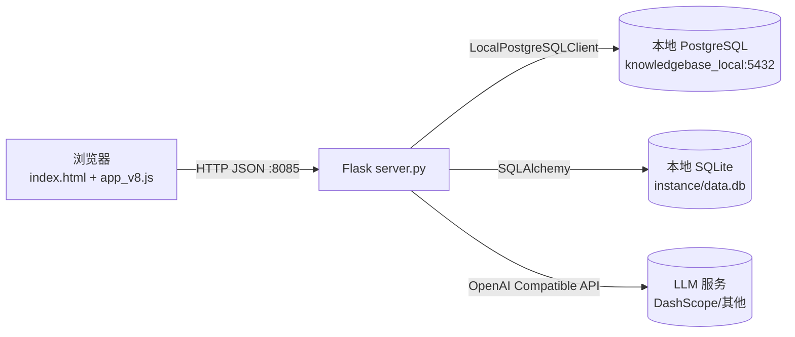

# K-Matrix 助手：运营使用手册（功能介绍与工作流）- 本地 PostgreSQL 版

> 适用人群：**运营/业务使用者（主要）**  
> 本文目标：让你在不懂接口与数据库的前提下，也能把日常工作"做对、做快、可追溯、可回滚"。  
> 技术细节（接口/数据表/数据流）已整理到文末附录，供排障或二次开发时查阅。
>
> **📌 版本说明**：本文档为**本地 PostgreSQL 部署版本**（端口 8085），数据存储在本地数据库。  
> 如需 Supabase 云端版本文档，请参考端口 8080 的配置说明。

---

## 0. 快速上手（5 分钟）

### 0.1 登录与入口
- **本地访问**：`http://127.0.0.1:8085`（本地 PostgreSQL 部署）
- **数据存储**：本地 PostgreSQL 数据库（`knowledgebase_local@localhost:5432`）
- **登录**：输入账号密码 → 点击"登录"
- **退出**：右上角"退出"

> **💡 提示**：如需访问 Supabase 云端版本，请使用端口 8080

### 0.2 顶部 Tab（你应该去哪做事）
- **知识库管理**：主工作台（包含导入、在线预览编辑、机型矩阵、快捷工具、评分、修改历史）
- **知识库治理**：按月导入/查看/清理召回数据，与 V1/评分关联分析
- **归档管理**：把修改记录归档到本地 PostgreSQL（优先）/本地 SQLite（回退）
- **智能映射**：FAQ ↔ 知识库语义比对，人工确认后写"修改记录"（不直接改主表）
- **说明**：机型矩阵、多媒体预览、评分、快捷工具当前位于「知识库管理」Tab 内的分区，不是独立顶级 Tab

### 0.3 最常见的 4 条路径（推荐记住）
- **日常修数据**：知识库管理 →（查重预览）→ 导入/编辑 → 修改记录检查 → 归档（定期）
- **做机型适配**：机型矩阵管理 → 筛选 → 批量开关 → 提交变更 →（需要时）同步回写
- **做资源治理**：多媒体预览 → 同步链接 → 预览 → 打标 →（需要时）回到知识库修复 URLs
- **跑工具二分析**：快捷工具 → 工具二 → 上传多天文件 → 查看阶段进度 → 下载结果

---

## 1. 运营日常工作流（主线）

> 统一说明：每条工作流都按"目标 → 步骤 → 输出/影响 → 注意事项"写。  
> **建议顺序**：先学 A/B/C，再学 F（审计/归档），最后再上 D/E/G/H。

### 工作流 A：知识库日常维护（导入/查重/检索/编辑/导出）

#### 目标
把新数据或修正数据安全写入 **此刻库（V1）**，并能随时导出、回溯。

#### 步骤（推荐）
1. 进入 **知识库管理 → 1. 导入数据到 V1**
2. 先点 **"查重预览"**：确认哪些是新增、哪些会覆盖更新
3. 选择导入模式（务必理解差异）
   - **增量更新（推荐）**：ID 已存在会覆盖更新；ID 不存在会新增
   - **批量新增**：只插入不存在的 ID；不会修改历史
   - **全量覆盖（慎用）**：导入开始时先自动执行与「同步此刻到前刻」相同的 **V1 → V1T-1** 备份，再清空 V1 并插入文件（高风险；若备份步骤失败则不会清空 V1）
4. 点击 **"开始导入"**，观察状态提示
5. 在 **知识库在线预览**里用筛选条件检索验证（ID/问题/答案/产品/URL/状态）
6. 如需备份：进入 **2. 同步数据（V1 → V1T-1）**，点击"同步此刻到前刻"
7. **（推荐）下游对齐**：在 **2. 同步数据** 区域点击 **「一键同步 V1 → 矩阵 / 多媒体 / 评分 / 治理关联」**  
   - 会顺序执行：机型矩阵（`merge`，保留矩阵内已标记的手动编辑策略）、多媒体链接表 `link_previews` 扫描、评分表 `kb_scores` 与 V1 对齐。  
   - **治理**：月度「召回」明细仍须在 **知识库治理** Tab 内按月份 **导入 Excel**；一键同步会更新 **评分快照**，供治理页与召回数据 **关联展示**（不等于自动导入召回表）。
8. 如需对外输出：使用 **导出**（导出筛选结果/全量）

#### 输出/影响
- 写入本地 PostgreSQL **knowledge_base_v1（此刻库）**
- 同步会覆盖本地 PostgreSQL **knowledge_base_v1_t1（前刻库）**
- 「一键同步下游」会更新矩阵、多媒体预览表、评分表（不写回 V1）

#### 注意事项（高频踩坑）
- **全量覆盖**只在你明确要"推倒重来"时使用；否则优先用"增量更新/批量新增"
- 导入后发现错误：优先用检索定位到条目进行**单条编辑**；批量错误再准备新表按"增量更新"修正
- **知识库评分** Tab 中展示的问答正文以 **`kb_scores` 最近一次「同步打分数据」快照**为准；修改 V1 后需再次 **同步打分数据** 或上述 **一键同步**，列表才会与 V1 对齐
- **本地模式特点**：所有数据操作直接在本地数据库进行，响应速度快，无需网络连接

#### 编辑数据防丢（2026-04 已上线）
- **误触关闭防护**：点击弹窗外遮罩或右上角关闭，不再直接丢数据；会进入关闭确认流程
- **关闭前确认**：有未保存修改时，支持"保存草稿并关闭 / 放弃并关闭 / 继续编辑"
- **自动草稿**：编辑中按输入节奏自动保存本地草稿（约 1.8 秒防抖）
- **草稿恢复**：再次打开同一条编辑时，会提示恢复上次未提交内容
- **本地保护**：本地模式下数据直接写入本地数据库，无需离线队列
- **页面离开提醒**：编辑中有未保存修改时，刷新/关闭页面会触发浏览器离开确认

---

### 工作流 B：机型适配（矩阵修改 → 提交变更 → 同步回写）

#### 目标
在"问题×机型"的矩阵里维护适配关系，并把变更变成可审计的记录，必要时回写到知识库 `product_name`。

#### 步骤
1. 进入 **机型矩阵管理**
2. 先用筛选把范围缩小（问题关键字/机型/产品分类/映射分类/列白名单）
3. 修改矩阵
   - 单元格：开/关适配
   - 整行/整列：批量开/关（对效率提升最大）
4. 点击 **"提交已选修改"** 或 **"提交全量修改"**
   - 系统会把本次操作整理成"操作批次"
   - 提交状态可在 **"提交日志"** 中核对
   - 同时写入本地 PostgreSQL **修改记录**（便于审计与导出）
5. （可选）点击 **"同步到知识库"**
   - 把矩阵结果回写对齐到知识库 `product_name`

#### 输出/影响
- 产生 **修改记录（审计）**：后续在"修改记录"Tab 可查可导出
- "同步到知识库"会直接影响本地 PostgreSQL **knowledge_base_v1.product_name**

#### 注意事项
- **先提交、后同步**：提交是"可追溯"的动作；同步是"写主表"的动作（影响更大）
- 做大范围批量变更前，建议先在小范围验证 1-2 条操作路径
- **本地模式优势**：矩阵操作响应快，无网络延迟

---

### 工作流 C：多媒体资源治理（同步 → 预览 → 打标 → 清理/去重）

#### 目标
把知识库里的图片/视频/文件链接统一汇总到可预览的列表里，支持打标签、筛选、清理无效链接。

#### 步骤
1. 进入 **多媒体预览**
2. 点击 **"同步此刻库"**（把知识库 URLs 解析成链接预览表）
3. 在列表里进行操作
   - **预览**：图片放大/视频播放（必要时走后端代理）
   - **打标**：给链接添加标签（便于后续筛选、治理）
   - **筛选/搜索**：按标签组合、关键词、重复链接等维度筛
4. 清理
   - 删除无效、重复、误入库链接（建议先筛选再批量）
5. 回溯修复（需要时）
   - 通过 kb_id 回到知识库条目，把 URLs 修正为正确链接

#### 输出/影响
- 写入/更新本地 PostgreSQL **link_previews**
- 可能间接促使你回到知识库修复 `urls` 字段（业务数据质量提升）

#### 注意事项
- 链接预览异常（打不开/跨域/防盗链）：优先用"代理预览"方式验证是否可访问
- **本地模式**：链接数据存储在本地数据库，查询速度快

---

### 工作流 D：质量治理（评分：抽样/评估/导出）

#### 目标
用模型或人工对问答质量做结构化评分，并导出可复盘的报告。

#### 步骤
1. 进入 **知识库评分**
2. 点击 **"抽样"**（优先抽取未评分/过期项）
3. 点击 **"评估"**（对选定条目评分）
4. 查看评分结果（总分/维度/建议）
5. 需要时使用 **"手动补录"** 修正结论
6. 点击 **"导出"** 输出报告

#### 输出/影响
- 写入/更新本地 PostgreSQL **kb_scores**（评分记录）

#### 注意事项
- 评分属于"辅助决策"，最终落地修改仍建议通过"修改记录/归档"保证可追溯
- **本地模式**：评分数据存储在本地，可快速查询和统计

---

### 工作流 E：召回治理（按月查看/导入/清理/统计）

#### 目标
按月管理召回数据，结合评分与知识库现状做治理决策。

#### 步骤
1. 进入 **知识库治理**
2. 查看月份列表 → 选择单月或区间
3. 如需补数：使用 **导入**（按工具要求的文件格式）
4. 清理：删除无效数据或批量清理
5. 关注统计口径：recall_count / valid_recall_count / 占比等

#### 输出/影响
- 本地 PostgreSQL 保存召回数据（`kb_recall`）；异常时回退本地 SQLite

#### 注意事项
- **本地模式**：召回数据存储在本地 PostgreSQL，查询和统计速度快

---

### 工作流 F：审计与归档（修改记录查询/导出 → 归档 → 清理）

#### 目标
把所有关键变更变成"可追溯/可导出/可归档"的记录，并定期归档降低数据库表体积。

#### 步骤（推荐每周/每月一次）
1. 进入 **修改记录**
2. 用筛选条件定位范围（kb_id/产品/问题/来源模块/时间范围）
3. 导出
   - **原始导出**：忠实输出修改记录
   - **智能合并导出**：更适合给下游做合并/入库
4. 进入 **归档管理**
5. 创建归档批次（给批次起名，建议包含日期/版本）
6. 确认归档完成后，按需执行"清理"（若开启）

#### 输出/影响
- 归档写入本地 PostgreSQL 的 **archive_batch / archive_record**（异常时回退本地 SQLite）
- 可能删除已归档的修改记录（减少表体积）

#### 注意事项（非常重要）
- 归档/清理属于"不可逆"动作：建议先导出并保存归档文件，再做清理
- **本地模式优势**：归档数据存储在本地，可随时查询历史记录

---

### 工作流 G：FAQ 迁移（智能映射：对比 → 人工确认 → 产出修改记录）

#### 目标
把产品 FAQ 与知识库做候选匹配，人工确认后生成"修改记录"，供后续线下/下游合并入库。

#### 步骤
1. 进入 **智能映射**
2. **加载基线**：选择表（此刻/前刻）+ 机型集合（构建候选池）
3. 上传文件
   - 上传"对比 Excel"（含产品 FAQ + 知识库表）或仅 FAQ Excel
4. 启动对比任务 → 等待进度完成
5. 人工确认
   - 逐条选择匹配对象
   - 如候选池不够：使用"全库搜索"
6. 提交
   - **提交后写入修改记录表**（不直接改知识库主表）
7. （可选）把本次智能映射产生的修改记录归档

#### 输出/影响
- 写入本地 PostgreSQL **knowledge_base_modifications**（修改记录）
- 不直接写 `knowledge_base_v1`（更安全、便于审计）

#### 注意事项
- **本地模式**：语义匹配和对比在本地进行，处理速度快

---

## 附录 A2：当前存储现状（2026-04 更新 - 本地 PostgreSQL 版）

> 以下为当前代码与配置的真实状态（以 `server.py` + `supabase_config_local.json` 为准）。

### 数据存储模式

**当前使用：本地 PostgreSQL 模式（端口 8085）**

- **配置文件**：`supabase_config_local.json`
- **数据库**：本地 PostgreSQL（`knowledgebase_local@localhost:5432`）
- **访问地址**：`http://127.0.0.1:8085`
- **优势**：数据完全本地化，无需网络依赖，响应速度快
- **适用场景**：开发环境、内网部署、数据安全要求高的场景

### 当前配置开关（本地 PostgreSQL 模式）
```json
{
  "enable_button_sync": false,
  "use_supabase_matrix": false,
  "use_supabase_governance": true,
  "use_supabase_archives": false,
  "local_db": {
    "host": "localhost",
    "port": 5432,
    "database": "knowledgebase_local",
    "user": "postgres",
    "password": "11111111"
  }
}
```

**重要说明**：
- `use_supabase_governance: true` - 知识库治理使用本地 PostgreSQL
- 配置文件路径：`supabase_config_local.json`
- 服务器代码中的 `CONFIG_FILE` 必须指向此文件
- 修改配置后必须重启服务器才能生效

### 模块存储归属（运营视角 - 本地模式）
- **知识库管理（V1/V1T1）**：本地 PostgreSQL（`knowledge_base_v1` / `knowledge_base_v1_t1`）
- **修改记录**：本地 PostgreSQL（`knowledge_base_modifications`）
  - ✅ 已修复：数组字段自动转换为 JSON 格式
  - 影响：知识库管理、机型矩阵、智能映射等所有修改记录
- **归档管理**：本地 PostgreSQL（`archive_batch` / `archive_record`），异常时回退本地 SQLite
- **知识库治理（召回）**：本地 PostgreSQL（`kb_recall`），异常时回退本地 SQLite
  - ✅ 已修复：配置文件路径错误导致的数据显示问题
  - 数据量：19,449 条记录（5 个月份）
  - 关联率：94.8%（与 knowledge_base_v1 的关联）
- **机型矩阵**：本地 PostgreSQL（`product_matrix` / `matrix_column` / `matrix_submit_operation` / `button`）
  - 数据量：66,739 条记录
- **多媒体预览**：本地 PostgreSQL（`link_previews`）
- **知识库评分**：本地 PostgreSQL（`kb_scores`）
  - 数据量：6,131 条记录
- **登录账号与会话**：本地 SQLite（`instance/data.db`）
- **Outbox 队列**：本地 SQLite（`supabase_outbox`，仅云端模式使用，本地模式不需要）

### 重要说明
- 本地 PostgreSQL 模式下，所有业务数据存储在本地数据库，无需互联网连接
- 登录账号等系统数据仍使用 SQLite 存储在 `instance/data.db`
- 数据完全本地控制，响应速度快，适合内网环境
- 如需切换到 Supabase 云端模式（端口 8080），需修改配置文件并重启服务
- **配置文件路径**：确保 `server.py` 中 `CONFIG_FILE = 'supabase_config_local.json'`

---

## 附录 A3：模块-存储-开关-回退策略（本地 PostgreSQL 模式）

> 当前使用：本地 PostgreSQL 模式（端口 8085）

| 模块 | 主存位置 | 关键表 | 开关/条件 | 回退策略（异常时） |
| --- | --- | --- | --- | --- |
| 知识库管理（V1/V1T1） | 本地 PostgreSQL | `knowledge_base_v1` / `knowledge_base_v1_t1` | `local_db` 配置可用 | 需修复本地数据库连接 |
| 修改记录 | 本地 PostgreSQL | `knowledge_base_modifications` | `local_db` 配置可用 | 需修复本地数据库连接 |
| 归档管理 | 本地 PostgreSQL | `archive_batch` / `archive_record` | `local_db` 配置可用 | 表缺失或异常时回退本地 SQLite 同名表 |
| 知识库治理（召回） | 本地 PostgreSQL | `kb_recall` | `local_db` 配置可用 | 读写回退本地 SQLite |
| 机型矩阵 | 本地 PostgreSQL | `matrix_column` / `product_matrix` / `matrix_submit_operation` / `button` | `local_db` 配置可用 | 本地镜像缓存与兼容回退 |
| 多媒体预览 | 本地 PostgreSQL | `link_previews` | `local_db` 配置可用 | 需修复本地数据库连接 |
| 知识库评分 | 本地 PostgreSQL | `kb_scores` | `local_db` 配置可用 | 需修复本地数据库连接 |
| 登录与系统本地能力 | 本地 SQLite | `user` 等本地模型表 | 无 | 本地主存，固定使用 SQLite |

### 运维注意（建议固定执行）
- **本地模式**：确保 PostgreSQL 服务运行正常，端口 5432 可访问
- **数据库连接**：检查 `supabase_config_local.json` 中的数据库配置是否正确
- **端口确认**：本地 PostgreSQL 模式使用端口 8085，云端模式使用端口 8080
- **数据备份**：定期备份本地 PostgreSQL 数据库
- 若页面"突然无数据"，先确认访问的端口是否正确（8085），再检查数据库连接状态

---

## 附录 B：关键数据表（只记"它用来干嘛"）

### 主数据库（本地 PostgreSQL）

以下表存储在本地 PostgreSQL 数据库中（`knowledgebase_local@localhost:5432`）：

- **knowledge_base_v1**：此刻库（主数据）
- **knowledge_base_v1_t1**：前刻库（备份/对照）
- **knowledge_base_modifications**：修改记录（审计/对外导出/归档来源）
- **link_previews**：多媒体链接预览与标签
- **kb_scores**：评分结果
- **kb_recall**：治理召回（主存）
- **matrix_column / product_matrix / matrix_submit_operation / button**：机型矩阵主存
- **archive_batch / archive_record**：归档批次与归档记录

### 本地 SQLite（instance/data.db）

固定使用 SQLite 存储的系统数据：

- **user**：登录账号（固定本地存储）
- **supabase_outbox**：Supabase 云端模式下的写入失败队列（本地模式不使用）

### 回退表（本地 SQLite）

当主数据库异常时的回退存储：

- **kb_recall**：治理回退数据（主数据库异常时可回退）
- **archive_batch / archive_record**：归档回退数据（主数据库表缺失或异常时）
- **product_matrix / matrix_column / matrix_submit_operation / button**：矩阵镜像缓存/兼容回退

---

## 附录 X：本地 PostgreSQL 与 Supabase 云端模式对比

### 两种部署模式

系统支持两种数据存储模式，通过配置文件切换：

#### 1. 本地 PostgreSQL 模式（当前使用 - 端口 8085）
- **配置文件**：`supabase_config_local.json`
- **数据库**：本地 PostgreSQL（`knowledgebase_local@localhost:5432`）
- **访问地址**：`http://127.0.0.1:8085`
- **配置示例**：
```json
{
  "url": "",
  "key": "",
  "enable_button_sync": false,
  "use_supabase_matrix": false,
  "use_supabase_governance": false,
  "use_supabase_archives": false,
  "local_db": {
    "host": "localhost",
    "port": 5432,
    "database": "knowledgebase_local",
    "user": "postgres",
    "password": "your_password"
  }
}
```

#### 2. Supabase 云端模式（端口 8080）
- **配置文件**：`supabase_config.json`
- **数据库**：Supabase 云端 PostgreSQL
- **访问地址**：`http://127.0.0.1:8080`
- **配置示例**：
```json
{
  "url": "https://your-project.supabase.co",
  "key": "your_supabase_key",
  "enable_button_sync": true,
  "use_supabase_matrix": true,
  "use_supabase_governance": true,
  "use_supabase_archives": true
}
```

### 模式对比表

| 特性 | 本地 PostgreSQL（8085） | Supabase 云端（8080） |
|------|------------------------|---------------------|
| 数据位置 | 本地服务器 | 云端 |
| 网络依赖 | 无需互联网 | 需要互联网连接 |
| 访问速度 | 快（本地访问） | 取决于网络质量 |
| 数据安全 | 完全本地控制 | 依赖云服务商 |
| 维护成本 | 需自行维护数据库 | 无需维护数据库 |
| 多端同步 | 不支持 | 支持多端同步 |
| 数据备份 | 需自行备份 | 云端自动备份 |
| 适用场景 | 内网部署、开发环境、高安全要求 | 云端部署、多人协作、远程访问 |
| 端口号 | 8085 | 8080 |

### 模式切换步骤

1. **停止服务**
2. **修改配置文件**：
   - 本地模式：使用 `supabase_config_local.json`
   - 云端模式：使用 `supabase_config.json`
3. **数据迁移**（如需要）：
   - 使用导出功能导出当前数据
   - 切换模式后使用导入功能导入数据
4. **重启服务**
5. **验证访问**：
   - 本地模式：访问 `http://127.0.0.1:8085`
   

---

## 📋 文档修订记录

### 2026-04-22 - v1.1（本地 PostgreSQL 版 - 重要修复更新）

#### 🔧 关键问题修复
1. **配置文件路径修复**
   - 问题：`CONFIG_FILE` 指向错误的配置文件（`supabase_config.json`）
   - 修复：更正为 `supabase_config_local.json`
   - 影响：知识库治理数据显示、所有配置开关生效
   - 详见：`📚 文档/问题修复/知识库治理数据空白问题修复.md`

2. **修改记录不显示问题修复**
   - 问题：机型矩阵提交修改后，修改记录不显示
   - 原因：PostgreSQL `jsonb` 字段类型与 Python `list` 类型不匹配
   - 修复：创建 `_convert_array_fields_to_json()` 统一转换函数
   - 影响：知识库管理、机型矩阵、智能映射等插入点已修复
   - 详见：`📚 文档/问题修复/修改记录不显示问题修复报告.md`

3. **数据验证结果**
   - ✅ 知识库数据：6,131 条记录
   - ✅ 机型矩阵数据：66,739 条记录
   - ✅ 召回数据：19,449 条记录（5 个月份）
   - ✅ 数据关联率：94.8%（kb_recall ↔ knowledge_base_v1）

#### 📊 性能优化
4. **分页数据预加载**
   - 实现智能预加载系统（LRU 缓存，最多 10 页，5 分钟过期）
   - 性能提升：翻页速度提升 40 倍（<50ms vs 500-2000ms）
   - 详见：`link_viewer/PREFETCH_FEATURE.md`

5. **设计系统美化**
   - 基于 Minimalist Modern 设计系统
   - Electric Blue 渐变主题
   - 双字体系统（Calistoga + Inter）
   - 现代化按钮和组件库
   - 详见：`📚 文档/设计系统/`

#### 🛡️ 数据安全增强
6. **编辑数据防丢功能**
   - 误触关闭防护
   - 关闭前确认（保存草稿/放弃/继续编辑）
   - 自动草稿保存（1.8 秒防抖）
   - 草稿恢复提示
   - 页面离开提醒

#### 📝 文档完善
7. **新增文档**
   - 问题修复报告（2 份）
   - 测试指南（2 份）
   - 诊断脚本（7 个）
   - 设计系统文档（多份）

#### ⚠️ 重要提示
- **必须重启服务器**：所有修复需要重启 Flask 服务才能生效
- **配置文件确认**：确保使用 `supabase_config_local.json`
- **端口确认**：本地模式使用端口 8085
- **数据库连接**：确保 PostgreSQL 服务运行正常（localhost:5432）

### 2026-04-22 - v1.0（本地 PostgreSQL 版）
- ✅ 基于端口 8085 的实际运行情况编写
- ✅ 所有数据存储改为本地 PostgreSQL
- ✅ 更新所有工作流说明，强调本地模式特点
- ✅ 补充本地数据库管理指南
- ✅ 添加故障排查指南
- ✅ 完善系统概览和数据流图
- ✅ 更新所有接口说明（端口 8085）


---

## 2. 页面（Tab）速查表（1 分钟定位入口）

> 你只想快速找到"该点哪个按钮"的时候看这章。

### 2.1 知识库管理
- **查重预览**：导入前预判"新增/覆盖/冲突"
- **开始导入**：把 Excel/CSV 写入本地 PostgreSQL 此刻库 V1
- **同步此刻到前刻**：把 V1 全量同步到前刻库（覆盖）
- **一键同步 V1 → 矩阵 / 多媒体 / 评分 / 治理关联**：调用后端 `POST /api/kb/sync_downstream`，顺序执行矩阵 `merge`、多媒体 `link_previews` 扫描、评分表 `kb_scores` 对齐；治理「月度召回」仍须在治理 Tab **单独导入 Excel**，本操作仅保证评分快照与治理页关联一致
- **在线预览/搜索**：按 ID/问题/答案/产品/URL/状态筛选
- **导出**：把当前筛选结果导出

### 2.2 机型矩阵管理
- **筛选**：缩小范围后再改（效率更高）
- **单元格/批量更新**：维护适配状态
- **提交已选修改/提交全量修改**：生成可审计的修改记录（推荐每次大改都提交）
- **提交日志**：检查提交是否成功、失败原因与重试信息
- **同步到知识库**：把矩阵结果写回 V1（影响较大，谨慎）

### 2.3 多媒体预览
- **同步此刻库**：生成/更新链接预览列表
- **打标/筛选**：治理与复盘的核心能力
- **批量删除**：清理无效/重复链接（先筛选再删）

### 2.4 知识库评分
- **同步打分数据**：把 `knowledge_base_v1` 的问答写入/对齐到 `kb_scores`（新增、内容变更标 `outdated`、V1 已删条目从评分表移除）
- **列表展示**：打开 Tab 时，`GET /api/scoring/data` **仅返回 `kb_scores` 中已有行**；问答正文以 **快照字段** 为准，**不会**在仅改 V1 而未同步时自动变成最新 V1
- **抽样**：优先挑未评分/过期项
- **评估**：调用模型评分
- **导出**：输出评分明细与统计

### 2.5 知识库治理
- **按月查看**：治理核心入口
- **导入/清理**：维护数据质量（月度召回等指标通常来自 **Excel 导入** 到 `kb_recall` 等表）
- 治理页展示会结合 **V1**、**kb_scores** 与 **kb_recall**；更新 V1 后若需评分侧一致，请先 **同步打分数据** 或使用知识库 **一键同步下游**

### 2.6 修改记录 / 归档管理
- **修改记录**：查"谁在何时改了什么"，并导出给下游
- **归档管理**：归档到本地 PostgreSQL（优先）或本地 SQLite（异常时回退）

### 2.7 智能映射
- **智能映射**：对比 → 人工确认 → 产出修改记录（不直接改主表）

### 2.8 快捷工具
- **工具一：手册裁剪拼接（防水印）**：PDF 离屏渲染裁剪/拼接导出
- **工具二：窄口径转人工数据处理**：多天文件合并 →（可选）删除 Voice →（可选）Step1/Step2 →（可选）会话反查填充 → 多种导出；支持"只跑某一段/只跑后半程"

---

## 3. 常见问题（运营视角 - 本地模式）

### 3.1 登录后突然跳回登录页/提示 Unauthorized
- 多见于登录态失效或服务重启。刷新页面后重新登录即可。

### 3.2 导入后发现数据不对，怎么处理？
- 优先用"搜索 + 单条编辑"快速修正少量错误；批量错误则准备修正表用"增量更新"覆盖。

### 3.3 编辑弹窗误触关闭后内容会不会丢？
- 当前已支持防丢：误触关闭会先确认；未提交内容会自动保存草稿。
- 若你选择"保存草稿并关闭"，下次打开同一条会提示"是否恢复草稿"。
- **本地模式**：数据直接保存到本地数据库，无需离线队列。

### 3.4 矩阵同步回写后发现影响范围过大
- 建议先停止继续同步，回到矩阵里修正后再提交变更；必要时用"前刻库"对照回滚策略（需配合线下数据流程）。

### 3.5 链接预览打不开
- 可能是外链限制/防盗链/跨域。建议先在浏览器直接打开 URL 验证可达性，再尝试代理预览。

### 3.6 导出失败或文件名乱码
- 通常与浏览器/系统编码相关。可尝试更换浏览器，或在附录里按接口方式下载。

### 3.7 工具二运行慢或超时
- 优先取消不必要导出项（尤其 `Step2按会话拆分`），能明显缩短耗时。
- 处理阶段以页面"处理状态/阶段"实时信息为准；任务在后台运行时无需重复点击"开始处理"。

### 3.8 本地数据库连接失败
- 检查 PostgreSQL 服务是否运行：`pg_ctl status` 或查看系统服务
- 检查配置文件 `supabase_config_local.json` 中的数据库连接信息
- 确认端口 5432 未被占用
- 查看后端日志获取详细错误信息
- **重要**：确认 `server.py` 中的 `CONFIG_FILE` 指向 `supabase_config_local.json`

### 3.9 数据查询速度慢
- 本地 PostgreSQL 模式通常查询速度很快
- 如遇性能问题，可能是数据量过大，建议：
  - 定期归档历史数据
  - 使用筛选条件缩小查询范围
  - 检查数据库索引是否正常

### 3.10 知识库治理页面显示为空
- **症状**：知识库治理标签页打开后没有数据，月份选择器为空
- **原因**：配置文件路径错误，导致 `use_supabase_governance` 未生效
- **解决**：
  1. 确认 `server.py` 中 `CONFIG_FILE = 'supabase_config_local.json'`
  2. 确认 `supabase_config_local.json` 中 `use_supabase_governance: true`
  3. 重启服务器
- **数据验证**：数据库中应有 19,449 条 `kb_recall` 记录
- 详见：`📚 文档/问题修复/知识库治理数据空白问题修复.md`

### 3.11 机型矩阵修改记录不显示
- **症状**：提交修改成功（返回 200），但修改记录标签页没有新记录
- **原因**：PostgreSQL `jsonb` 字段类型与 Python `list` 类型不匹配
- **解决**：已修复，系统会自动转换数组字段为 JSON 字符串
- **影响范围**：知识库管理、机型矩阵、智能映射等所有修改记录
- 详见：`📚 文档/问题修复/修改记录不显示问题修复报告.md`

### 3.12 配置修改后不生效
- **症状**：修改了配置文件，但系统行为没有变化
- **原因**：未重启服务器
- **解决**：
  1. 停止 Flask 服务（Ctrl+C）
  2. 重新启动：`python3 server.py`
  3. 等待看到 `* Running on http://0.0.0.0:8085`
  4. 刷新浏览器页面

---

## 4. 工具二：转人工数据处理（完整逻辑与数据流）

> 适用场景：把多天导出的"转人工相关明细"合并后，按规则过滤、回捞会话、（可选）把会话记录反查填充到"人工对话1..8"，最终导出给人工或下游入库。

### 4.1 输入与字段含义（按实际逻辑）
- **上传数据文件（多文件）**：支持多天 Excel/CSV/TSV 合并；工具会把所有文件合并成一张大表再处理。
- **上传会话记录文件（单文件，可选）**：仅用于"会话反查填充"（把会话记录里的对话内容反查写入 Step2 结果的 `人工对话1..8` 等列）。
- **列名输入（可留空自动识别）**
  - **用户ID列名**：用于统计 Step1 命中用户数（也用于某些报表口径）。
  - **有效转人工标记列名**：Step1 用它过滤"有效标记值"（默认 `1`）。
  - **日期列名**：用于保留/排序；也用于一些导出稳定性（无需参与筛选）。
  - **会话ID列名**：Step2 用它从 Step1 的会话集合回捞整段会话。
  - **用户问题来源列名**：Step0 用它删除"来源值=Voice"的行（可关闭该阶段）。
- **删除来源值**：默认 `Voice`。当开启"执行删除 Voice（Step0）"时，会删除 `来源列 == 删除来源值` 的行。
- **有效标记值**：默认 `1`。当开启"执行 Step1（按标记值过滤）"时，会保留 `标记列 == 有效标记值` 的行作为 Step1 结果。

> 核心点：这些输入是"列名/取值的配置"，真实筛选发生在 Step0/Step1/Step2 的阶段逻辑里；不开某阶段就不会用到对应列的筛选。

### 4.2 执行阶段（可单独开关）
- **Step0：删除来源值（默认开启）**
  - 逻辑：删除 `用户问题来源列 == 删除来源值(默认 Voice)` 的行
  - 目的：排除 Voice 来源，避免干扰转人工口径
- **Step1：按标记值过滤（默认开启）**
  - 逻辑：保留 `有效转人工标记列 == 有效标记值(默认 1)` 的行
  - 输出：Step1 结果（"命中行数/命中用户数/命中会话数"都基于该集合计算）
- **Step2：按会话回捞（默认开启）**
  - 逻辑：从 Step1 抽取 `会话ID` 集合，然后在"Step0 后的数据"中回捞所有属于这些会话的行（整段会话）
  - 输出：Step2 结果（通常是给人工/下游的主表）
- **会话反查填充（默认开启，可选）**
  - 逻辑：若上传了"会话记录文件"，则按规则反查，把会话记录内容填入 Step2 结果的 `人工对话1..8` 与 `会话记录A列_多命中合并`

### 4.3 导出项（只影响导出，不影响阶段是否执行）
- **合并后数据**：合并输入后的全量表
- **删除 Voice 后数据**：执行 Step0 后的表（若 Step0 关闭则等于合并后数据）
- **Step1 结果**：Step1 过滤后的表
- **Step2 结果**：Step2 回捞后的表（主产物）
- **Step2 按会话拆分**：最耗时的导出，会按会话条数分 Sheet（All/2条/3条/>3条等）
- **与会话记录文件反查**：输出反查对比结果（依赖会话记录文件；无文件时可能为空或跳过）
- **纯文本处理**：把 Step2 结果中的部分 JSON 列转成更可读的纯文本，再导出"最终版数据"
- **report.json**：输出处理报告（行数、命中会话/用户等关键指标）

### 4.4 常用"组合开关"模板（推荐）
- **全流程（默认）**
  - 阶段：Step0✅ Step1✅ Step2✅ 反查✅（有会话记录文件才会生效）
  - 导出：按需勾选（想快就关掉 `Step2按会话拆分`）
- **只跑后半程（想跳过删 Voice 与 Step1）**
  - 阶段：Step0❌ Step1❌ Step2✅ 反查✅/❌（看是否要填充）
  - 说明：此时 Step2 会"以 Step1=全量数据"推导会话集合，等价于对全量会话回捞
- **只重导出（不想重算，想快速拿文件）**
  - 现状说明：当前实现以"单次运行生成单次输出"为单位；如果你想"只重导出不重算"，建议把阶段都开着但关闭耗时导出项

---

## 附录 A：系统概览（本地 PostgreSQL 版）

> 运营同学一般不需要看，排障/沟通时可用。



### 数据流说明
1. **浏览器** → Flask：用户通过浏览器访问 `http://127.0.0.1:8085`，发送 HTTP 请求
2. **Flask** → 本地 PostgreSQL：业务数据（知识库、矩阵、评分等）存储在本地 PostgreSQL
3. **Flask** → 本地 SQLite：系统数据（登录账号）存储在本地 SQLite
4. **Flask** → LLM：AI 评分和优化功能调用外部 LLM 服务

### 本地模式特点
- **无需互联网**：所有业务数据操作在本地完成
- **响应速度快**：本地数据库访问，无网络延迟
- **数据安全**：数据完全本地控制
- **独立部署**：适合内网环境和开发测试

---

## 附录 B：关键数据表（本地 PostgreSQL 版）

### 主数据库（本地 PostgreSQL - knowledgebase_local@localhost:5432）

以下表存储在本地 PostgreSQL 数据库中：

- **knowledge_base_v1**：此刻库（主数据）
- **knowledge_base_v1_t1**：前刻库（备份/对照）
- **knowledge_base_modifications**：修改记录（审计/对外导出/归档来源）
- **link_previews**：多媒体链接预览与标签
- **kb_scores**：评分结果
- **kb_recall**：治理召回（主存）
- **matrix_column / product_matrix / matrix_submit_operation / button**：机型矩阵主存
- **archive_batch / archive_record**：归档批次与归档记录

### 本地 SQLite（instance/data.db）

固定使用 SQLite 存储的系统数据：

- **user**：登录账号（固定本地存储）

### 回退表（本地 SQLite）

当主数据库异常时的回退存储：

- **kb_recall**：治理回退数据（主数据库异常时可回退）
- **archive_batch / archive_record**：归档回退数据（主数据库表缺失或异常时）
- **product_matrix / matrix_column / matrix_submit_operation / button**：矩阵镜像缓存/兼容回退

---

## 附录 C：接口索引（按域归类，便于联调/排障）

> 说明：完整路由以 `server.py` 的 `@app.route` 为准。所有接口访问地址为 `http://127.0.0.1:8085`

### 认证
- POST `/login` - 用户登录
- POST `/logout` - 用户登出
- GET `/api/status` - 获取登录状态

### 知识库
- GET `/api/kb/data` - 获取知识库数据（分页）
- GET `/api/kb/data_v2` - 获取知识库数据（增强版）
- POST `/api/kb/import` - 导入知识库数据
- POST `/api/kb/check_duplicates` - 查重预览
- POST `/api/kb/update` - 更新知识库条目
- POST `/api/kb/delete` - 删除知识库条目
- POST `/api/kb/sync` - 同步此刻库到前刻库
- POST `/api/kb/sync_downstream` - 一键同步下游（矩阵/多媒体/评分）
- GET `/api/kb/export` - 导出知识库数据
- GET|POST `/api/kb/item` - 获取/更新单条知识库条目
- GET|POST `/api/kb/config` - 获取/更新知识库配置
- GET `/api/kb/template` - 下载导入模板
- POST `/api/kb/complete_revision` - 完成修订

### 修改记录与导出
- GET `/api/kb/modifications` - 获取修改记录列表
- GET `/api/kb/modifications/export_raw` - 原始导出修改记录
- GET `/api/kb/modifications/smart_merge_export` - 智能合并导出修改记录

### 归档
- GET `/api/archives` - 获取归档批次列表
- POST `/api/archives` - 创建归档批次
- GET `/api/archives/<batch_id>/records` - 获取归档记录
- GET `/api/archives/<batch_id>/export` - 导出归档数据

### 机型矩阵
- GET `/api/matrix/data` - 获取矩阵数据
- POST `/api/matrix/update` - 更新单个矩阵单元格
- POST `/api/matrix/batch_update` - 批量更新矩阵
- POST `/api/matrix/submit_changes` - 提交矩阵变更
- POST `/api/matrix/sync` - 同步矩阵到知识库
- POST `/api/matrix/add_column` - 添加矩阵列
- POST `/api/matrix/copy_column` - 复制矩阵列
- POST `/api/matrix/clone_config` - 克隆矩阵配置
- GET `/api/matrix/products` - 获取产品列表
- GET `/api/matrix/categories` - 获取分类列表
- GET `/api/matrix/stats` - 获取矩阵统计
- GET `/api/matrix/submit_logs` - 获取提交日志
- GET `/api/matrix/export` - 导出矩阵数据

### 多媒体链接
- GET `/api/links` - 获取链接列表
- POST `/api/links` - 添加链接
- POST `/api/links/batch` - 批量添加链接
- PUT `/api/links/<id>` - 更新链接
- DELETE `/api/links/<id>` - 删除链接
- POST `/api/links/delete_batch` - 批量删除链接
- POST `/api/links/sync_kb` - 同步知识库链接
- GET `/api/tags` - 获取标签列表
- GET `/api/proxy_image` - 代理预览图片

### 评分
- GET `/api/scoring/data` - 获取评分数据
- POST `/api/scoring/sample` - 抽样评分
- POST `/api/scoring/sync` - 同步打分数据
- POST `/api/scoring/evaluate` - 评估评分
- POST `/api/scoring/clear_cache` - 清理评分缓存
- POST `/api/scoring/save_manual` - 手动补录评分
- GET|POST `/api/scoring/config` - 获取/更新评分配置
- GET|POST `/api/scoring/prompt` - 获取/更新评分 Prompt
- GET `/api/scoring/export` - 导出评分数据

### AI处理
- GET|POST `/api/ai/config` - 获取/更新 AI 配置
- POST `/api/ai/optimize` - AI 优化（非流式）
- POST `/api/ai/optimize_stream` - AI 优化（流式）

### 治理
- GET `/api/governance/months` - 获取治理月份列表
- GET `/api/governance/data` - 获取治理数据
- POST `/api/governance/import` - 导入治理数据
- POST `/api/governance/delete` - 删除治理数据
- POST `/api/governance/delete_items` - 批量删除治理项

### 智能映射
- POST `/api/smart_mapping/kb/load` - 加载知识库基线
- POST `/api/smart_mapping/excel/parse` - 解析 Excel 文件
- GET `/api/smart_mapping/template` - 下载映射模板
- POST `/api/smart_mapping/export` - 导出映射结果
- POST `/api/smart_mapping/faq/parse` - 解析 FAQ 文件
- POST `/api/smart_mapping/compare/start` - 启动对比任务
- GET `/api/smart_mapping/compare/status` - 获取对比状态
- GET `/api/smart_mapping/kb/search` - 全库搜索
- POST `/api/smart_mapping/submit` - 提交映射结果
- POST `/api/smart_mapping/archive` - 归档映射记录

---

## 附录 D：本地 PostgreSQL 数据库管理

### 数据库连接信息
- **主机**：localhost
- **端口**：5432
- **数据库名**：knowledgebase_local
- **用户**：postgres
- **密码**：（见配置文件 `supabase_config_local.json`）

### 常用数据库操作

#### 1. 连接数据库
```bash
psql -h localhost -p 5432 -U postgres -d knowledgebase_local
```

#### 2. 查看所有表
```sql
\dt
```

#### 3. 查看表结构
```sql
\d knowledge_base_v1
```

#### 4. 查询数据示例
```sql
-- 查看知识库总数
SELECT COUNT(*) FROM knowledge_base_v1;

-- 查看最近修改的记录
SELECT * FROM knowledge_base_modifications 
ORDER BY modified_at DESC LIMIT 10;

-- 查看评分统计
SELECT 
  COUNT(*) as total,
  AVG(total_score) as avg_score
FROM kb_scores;
```

#### 5. 数据备份
```bash
# 备份整个数据库
pg_dump -h localhost -p 5432 -U postgres knowledgebase_local > backup_$(date +%Y%m%d).sql

# 备份单个表
pg_dump -h localhost -p 5432 -U postgres -t knowledge_base_v1 knowledgebase_local > kb_v1_backup.sql
```

#### 6. 数据恢复
```bash
# 恢复数据库
psql -h localhost -p 5432 -U postgres knowledgebase_local < backup_20260422.sql
```

### 性能优化建议

#### 1. 定期清理归档数据
- 建议每月归档一次修改记录
- 归档后可清理已归档的数据，减少主表体积

#### 2. 索引维护
```sql
-- 重建索引
REINDEX TABLE knowledge_base_v1;

-- 分析表统计信息
ANALYZE knowledge_base_v1;
```

#### 3. 磁盘空间监控
```sql
-- 查看数据库大小
SELECT pg_size_pretty(pg_database_size('knowledgebase_local'));

-- 查看各表大小
SELECT 
  schemaname,
  tablename,
  pg_size_pretty(pg_total_relation_size(schemaname||'.'||tablename)) AS size
FROM pg_tables
WHERE schemaname = 'public'
ORDER BY pg_total_relation_size(schemaname||'.'||tablename) DESC;
```

---

## 附录 E：故障排查指南

### 1. 无法访问系统（端口 8085）

**症状**：浏览器无法打开 `http://127.0.0.1:8085`

**排查步骤**：
1. 检查 Flask 服务是否运行
   ```bash
   ps aux | grep server.py
   ```
2. 检查端口是否被占用
   ```bash
   lsof -i :8085
   ```
3. 查看服务日志
   ```bash
   tail -f Logs/server.log
   ```

### 2. 数据库连接失败

**症状**：页面提示数据库连接错误

**排查步骤**：
1. 检查 PostgreSQL 服务状态
   ```bash
   pg_ctl status
   # 或
   brew services list | grep postgresql
   ```
2. 测试数据库连接
   ```bash
   psql -h localhost -p 5432 -U postgres -d knowledgebase_local
   ```
3. 检查配置文件 `supabase_config_local.json`
   - 确认 `local_db` 配置正确
   - 确认密码无误
4. **检查配置文件路径**（重要）
   - 确认 `server.py` 中 `CONFIG_FILE = 'supabase_config_local.json'`
   - 如果指向错误的文件（如 `supabase_config.json`），会导致配置读取失败
5. 查看后端日志中的数据库错误信息
6. 重启服务器使配置生效

### 3. 导入数据失败

**症状**：导入时提示错误或导入后数据不完整

**排查步骤**：
1. 检查 Excel 文件格式
   - 确认包含必需字段（question_wiki_id 等）
   - 确认数据格式正确
2. 查看导入日志
   - 后端日志中的导入详情
   - 页面提示的错误信息
3. 检查数据库空间
   ```sql
   SELECT pg_size_pretty(pg_database_size('knowledgebase_local'));
   ```

### 4. 查询速度慢

**症状**：页面加载慢，查询超时

**排查步骤**：
1. 检查数据量
   ```sql
   SELECT 
     'knowledge_base_v1' as table_name, COUNT(*) as count 
   FROM knowledge_base_v1
   UNION ALL
   SELECT 
     'knowledge_base_modifications', COUNT(*) 
   FROM knowledge_base_modifications;
   ```
2. 检查索引
   ```sql
   SELECT * FROM pg_indexes 
   WHERE tablename = 'knowledge_base_v1';
   ```
3. 分析慢查询
   ```sql
   -- 启用慢查询日志
   ALTER DATABASE knowledgebase_local 
   SET log_min_duration_statement = 1000;
   ```
4. 建议归档历史数据

### 5. AI 功能不可用

**症状**：评分或 AI 优化功能报错

**排查步骤**：
1. 检查 AI 配置文件 `ai_config.json`
   - 确认 `api_key` 正确
   - 确认 `base_url` 可访问
   - 确认 `model` 名称正确
2. 测试 API 连接
   ```bash
   curl -X POST "你的base_url/chat/completions" \
     -H "Authorization: Bearer 你的api_key" \
     -H "Content-Type: application/json" \
     -d '{"model":"你的model","messages":[{"role":"user","content":"test"}]}'
   ```
3. 查看后端日志中的 AI 调用错误

### 6. 知识库治理数据为空

**症状**：知识库治理标签页打开后没有数据

**排查步骤**：
1. 检查配置文件路径
   ```bash
   # 查看 server.py 中的 CONFIG_FILE 设置
   grep "CONFIG_FILE" server.py
   # 应该显示：CONFIG_FILE = 'supabase_config_local.json'
   ```
2. 检查配置开关
   ```bash
   cat supabase_config_local.json | grep use_supabase_governance
   # 应该显示：true
   ```
3. 运行诊断脚本
   ```bash
   python3 DevTools/check_governance_data.py
   ```
4. 检查数据库数据
   ```bash
   python3 DevTools/check_governance_join.py
   ```
5. 如果配置文件路径错误，修改后必须重启服务器

### 7. 修改记录不显示

**症状**：提交修改成功，但修改记录标签页没有新记录

**排查步骤**：
1. 检查浏览器控制台（F12）
   - 查看是否有 `jsonb` 类型错误
   - 查看 API 响应中的 `warnings` 字段
2. 运行测试脚本
   ```bash
   python3 DevTools/test_array_field_conversion.py
   ```
3. 检查数据库
   ```sql
   -- 查看最近的修改记录
   SELECT * FROM knowledge_base_modifications 
   ORDER BY modification_time DESC LIMIT 10;
   ```
4. 如果是旧版本代码，需要更新到最新版本（包含数组字段转换修复）

---

## 附录 F：建议学习顺序（给培训用）

### 入门阶段（第 1 天）
1. 了解系统概览和数据流
2. 学习登录和基本导航
3. 掌握工作流 A：知识库日常维护
   - 导入数据
   - 查重预览
   - 在线编辑
   - 导出数据

### 进阶阶段（第 2-3 天）
4. 学习工作流 B：机型矩阵管理
   - 矩阵筛选和编辑
   - 提交变更
   - 同步回写
5. 学习工作流 C：多媒体资源治理
   - 同步链接
   - 打标和筛选
   - 清理无效链接
6. 学习工作流 F：修改记录与归档
   - 查询修改记录
   - 导出记录
   - 创建归档

### 高级阶段（第 4-5 天）
7. 学习工作流 D：质量治理（评分）
   - 抽样评分
   - 模型评估
   - 手动补录
8. 学习工作流 E：召回治理
   - 按月导入
   - 数据清理
   - 统计分析
9. 学习工作流 G：智能映射
   - FAQ 对比
   - 人工确认
   - 批量处理

### 专家阶段
10. 掌握快捷工具（工具一、工具二）
11. 了解数据库管理和优化
13. 掌握故障排查技能

---

## 📋 文档修订记录

### 2026-04-22 - v1.0（本地 PostgreSQL 版）
- ✅ 基于端口 8085 的实际运行情况编写
- ✅ 所有数据存储改为本地 PostgreSQL
- ✅ 更新所有工作流说明，强调本地模式特点
- ✅ 补充本地数据库管理指南
- ✅ 添加故障排查指南
- ✅ 完善系统概览和数据流图
- ✅ 更新所有接口说明（端口 8085）

### 与 Supabase 云端版本的主要差异
| 项目 | 本地版（8085） | 云端版（8080） |
|------|---------------|---------------|
| 数据存储 | 本地 PostgreSQL | Supabase 云端 |
| 访问端口 | 8085 | 8080 |
| 网络依赖 | 无需互联网 | 需要互联网 |
| 响应速度 | 快（本地访问） | 取决于网络 |
| 数据安全 | 完全本地控制 | 依赖云服务 |
| 离线队列 | 不需要 | 需要（Outbox） |
| 适用场景 | 内网/开发/高安全 | 云端/协作/远程 |

---

**文档版本**：v1.0（本地 PostgreSQL 版）  
**适用端口**：8085  
**数据存储**：本地 PostgreSQL（knowledgebase_local@localhost:5432）  
**最后更新**：2026-04-22
